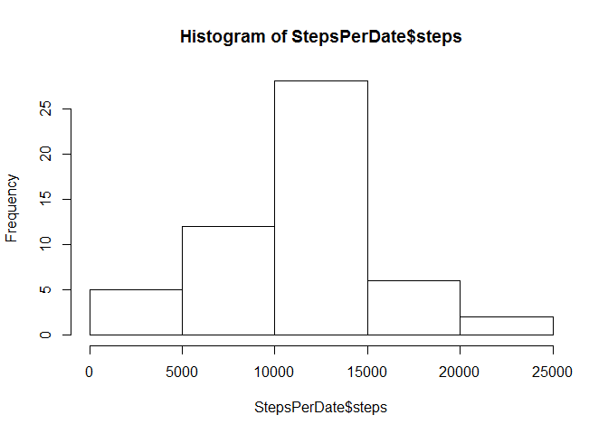
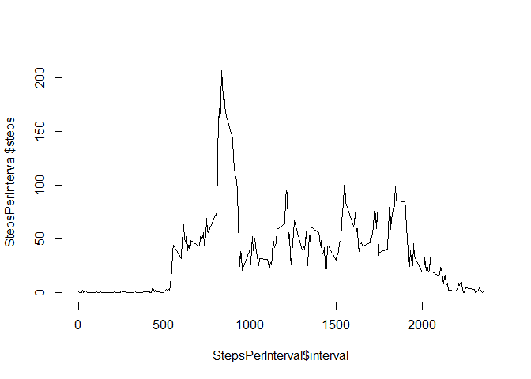
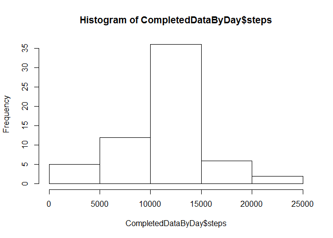
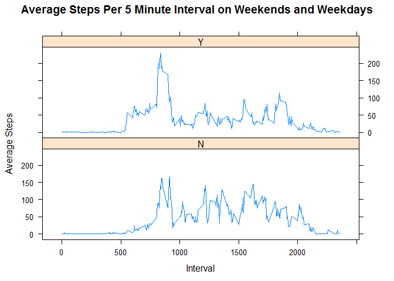

# Reproducible Research: Course Project 1

##Data

The data for this assignment can be downloaded from the course web site:

Dataset: Activity monitoring data [52K]

The variables included in this dataset are:

steps: Number of steps taking in a 5-minute interval (missing values are coded as NA)

date: The date on which the measurement was taken in YYYY-MM-DD format

interval: Identifier for the 5-minute interval in which measurement was taken


```r
library(dplyr)
```

```
## 
## Attaching package: 'dplyr'
## 
## The following object is masked from 'package:stats':
## 
##     filter
## 
## The following objects are masked from 'package:base':
## 
##     intersect, setdiff, setequal, union
```

```r
library(lattice)
```

##Loading and Preprocessing data

We load our libraries and import our data file


```r
data<-read.csv(file = 'activity.csv',header= TRUE)
```

##What is mean total number of steps taken per day?

1.Calculate the total number of steps taken per day


```r
StepsPerDate <- data %>% filter(!is.na(steps)) %>% group_by(date) %>% summarise_each(funs(sum))
StepsPerDate$date<-strptime(StepsPerDate$date, format = "%m/%d/%Y")
```

2.If you do not understand the difference between a histogram and a barplot, research the difference between them. Make a histogram of the total number of steps taken each day


Are there differences in activity patterns between weekdays and weekends?

For this part the weekdays() function may be of some help here. Use the dataset with the filled-in missing values for this part.

Create a new factor variable in the dataset with two levels - "weekday" and "weekend" indicating whether a given date is a weekday or weekend day.

Make a panel plot containing a time series plot (i.e. type = "l") of the 5-minute interval (x-axis) and the average number of steps taken, averaged across all weekday days or weekend days (y-axis). See the README file in the GitHub repository to see an example of what this plot should look like using simulated data.


```r
hist(StepsPerDate$steps)
```

 

3.Calculate and report the mean and median of the total number of steps taken per day


```r
mean(StepsPerDate$steps)
```

```
## [1] 10766.19
```

```r
median(StepsPerDate$steps)
```

```
## [1] 10765
```


##Average Daily Activity Pattern

Make a time series plot (i.e. type = "l") of the 5-minute interval (x-axis) and the average number of steps taken, averaged across all days (y-axis)


```r
StepsPerInterval <- data %>% filter(!is.na(steps)) %>% group_by(interval) %>% summarise_each(funs(mean)) %>% select(interval,steps)
plot(StepsPerInterval$interval,StepsPerInterval$steps,type="l")
```

 

Which 5-minute interval, on average across all the days in the dataset, contains the maximum number of steps?


```r
##In order to solve this, we sort the table by average steps per interval in decreasing order and take the highest value
StepsPerInterval$interval[order(StepsPerInterval$steps,decreasing=TRUE)[1]]
```

```
## [1] 835
```

#Imputing missing values
Note that there are a number of days/intervals where there are missing values (coded as NA). The presence of missing days may introduce bias into some calculations or summaries of the data.

Calculate and report the total number of missing values in the dataset (i.e. the total number of rows with NAs)


```r
TotalNAs <- data %>% filter(is.na(steps)) 
nrow(TotalNAs)
```

```
## [1] 2304
```

Devise a strategy for filling in all of the missing values in the dataset. The strategy does not need to be sophisticated. For example, you could use the mean/median for that day, or the mean for that 5-minute interval, etc.

Create a new dataset that is equal to the original dataset but with the missing data filled in.


```r
##We'll go with the mean for the 5-minute interval, as we already calculated the averages above
##First we'll copy the original table into a new table noNAdata and remove all the values with NAs
noNAdata <- data %>% filter(!is.na(steps)) 
##Then we'll fill in the values by performing a merge between the table with NAs and the StepsPerInterval table from above
NAReplacement <- merge(TotalNAs,StepsPerInterval,by="interval") %>% select(steps.y,date,interval) %>% rename(steps = steps.y)
##Now we'll add the two tables together using rowbind
CompletedData <- rbind(noNAdata,NAReplacement)
```

Make a histogram of the total number of steps taken each day and Calculate and report the mean and median total number of steps taken per day. Do these values differ from the estimates from the first part of the assignment? What is the impact of imputing missing data on the estimates of the total daily number of steps?


```r
CompletedDataByDay<- CompletedData  %>% group_by(date) %>% summarise_each(funs(sum))
hist(CompletedDataByDay$steps)
```

 

```r
##Mean and Median Steps per day in Original Dataset
mean(CompletedDataByDay$steps)
```

```
## [1] 10766.19
```

```r
median(CompletedDataByDay$steps)
```

```
## [1] 10766.19
```

```r
##Mean and Median Steps per day in dataset with missing values filled in
mean(StepsPerDate$steps)
```

```
## [1] 10766.19
```

```r
median(StepsPerDate$steps)
```

```
## [1] 10765
```


##Are there differences in activity patterns between weekdays and weekends?

Create a new factor variable in the dataset with two levels - "weekday" and "weekend" indicating whether a given date is a weekday or weekend day.

Make a panel plot containing a time series plot (i.e. type = "l") of the 5-minute interval (x-axis) and the average number of steps taken, averaged across all weekday days or weekend days (y-axis). See the README file in the GitHub repository to see an example of what this plot should look like using simulated data.


```r
CompletedData$date <- strptime(CompletedData$date, format = "%m/%d/%Y")
CompletedData$wkday <- ifelse(weekdays(CompletedData$date) %in% c("Monday","Tuesday","Wednesday","Thursday","Friday"),"Y","N")

CompletedDataByIntervalWkdys <- CompletedData %>% select(steps,interval,wkday)  %>% group_by(wkday,interval) %>% summarise_each(funs(mean))

xyplot(steps ~ interval | factor(wkday), data=CompletedDataByIntervalWkdys, type="l", layout=c(1,2), xlab="Interval", ylab="Average Steps", main="Average Steps Per 5 Minute Interval on Weekends and Weekdays" ) 
```

 
